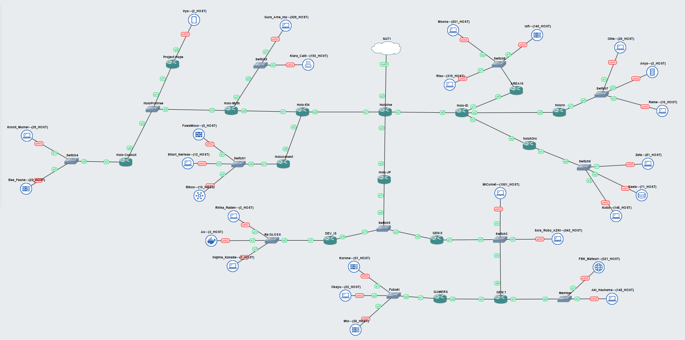

# Jarkom-Modul-4-IT24-2024

| Nama | NRP |
|---|---|
|Amoes Noland|5027231028|
|Radella Chesa Syaharani|5027231064|

## Daftar Isi

- [Jarkom-Modul-4-IT24-2024](#jarkom-modul-4-it24-2024)
  - [Daftar Isi](#daftar-isi)
  - [Pendahuluan](#pendahuluan)
  - [Topologi](#topologi)
  - [Routing Table](#routing-table)
  - [Subnetting GNS - Metode CIDR](#subnetting-gns---metode-cidr)
    - [Penggabungan IP](#penggabungan-ip)
    - [Tree CIDR](#tree-cidr)
    - [Pembagian IP](#pembagian-ip)
    - [Routing](#routing)
    - [Testing](#testing)
  - [Subnetting Cisco Packet Tracer - Metode VLSM](#subnetting-cisco-packet-tracer---metode-vlsm)
    - [Tree VLSM](#tree-vlsm)
    - [Pembagian IP](#pembagian-ip-1)
    - [Konfigurasi](#konfigurasi)
    - [Routing](#routing-1)
    - [Testing](#testing-1)

## Pendahuluan

## Topologi
Topologi GNS3 CIDR

## Routing Table

| Nama Subnet | Rute | Jumlah IP | Netmask |
|---|---|---|---|
| A1 | Hololive > HoloID | 2 | /30 |
| A2 | Hololive > HoloID > AREA-15 | 2 | /30 |
| A3 | Hololive > HoloID > AREA-15 > Switch6 > Moona + Risu + lofi | 661 | /22 |
| A4 | Hololive > HoloID > holoro | 2 | /30 |
| A5 | Hololive > HoloID > holoro > Switch7 > Ollie + Anya + Reine | 34 | /26 |
| A6 | Hololive > HoloID > holoh3ro | 2 | /30 |
| A7 | Hololive > HoloID > holoh3ro > Switch8 > Zeta + Kaela + Kobo | 299 | /23 |
| A8 | Hololive > HoloJP | 2 | /30 |
| A9 | Hololive > HoloJP > Switch1 > DEV_IS + GEN:0 | 3 | /29 |
| A10 | Hololive > HoloJP > Switch1 > DEV_IS > Re:Gloss > Ririka_Raden + Ao + Hajime_Kanade | 14 | /28 |
| A11 | Hololive > HoloJP > Switch1 > GEN:0 > Switch3 > MiComet + Sora_Robo_AZK + GEN:1 | 2045 | /21 |
| A12 | Hololive > HoloJP > Switch1 > GEN:0 > Switch3 > GEN:1 > Member > FBK_Matsuri + Aki_Hachama | 470 | /23 |
| A13 | Hololive > HoloJP > Switch1 > GEN:0 > Switch3 > GEN:1 > GAMERS | 2 | /30 |
| A14 | Hololive > HoloJP > Switch1 > GEN:0 > Switch3 > GEN:1 > GAMERS > Fubuki > Korone + Okayu + Mio | 120 | /25 |
| A15 | Hololive > HoloEN | 2 | /30 |
| A16 | Hololive > HoloEN > HoloAdvent | 2 | /30 |
| A17 | Hololive > HoloEN > HoloAdvent > Switch0 > FuwaMoco + Shiori_Nerissa + Biboo | 28 | /27 |
| A18 | Hololive > HoloEN > Holo-Myth | 2 | /30 |
| A19 | Hololive > HoloEN > Holo-Myth > Switch2 > Gura_Ame_Ina + Kiara_Calli | 503 | /23 |
| A20 | Hololive > HoloEN > Holo-Myth > HoloPromise > Project-Hope + Holo_Council | 3 | /29 |
| A21 | Hololive > HoloEN > Holo-Myth > HoloPromise > Project-Hope > Irys | 3 | /29 |
| A22 | Hololive > HoloEN > Holo-Myth > HoloPromise > Holo-Council > Switch4 > Kronii_Mumei + Bae_Fauna | 62 | /26 |
| Total | | 4263 | /19 |

## Subnetting GNS - Metode CIDR

### Penggabungan IP

### Tree CIDR

### Pembagian IP

### Routing

### Testing

## Subnetting Cisco Packet Tracer - Metode VLSM

### Tree VLSM

### Pembagian IP

### Konfigurasi

### Routing

### Testing