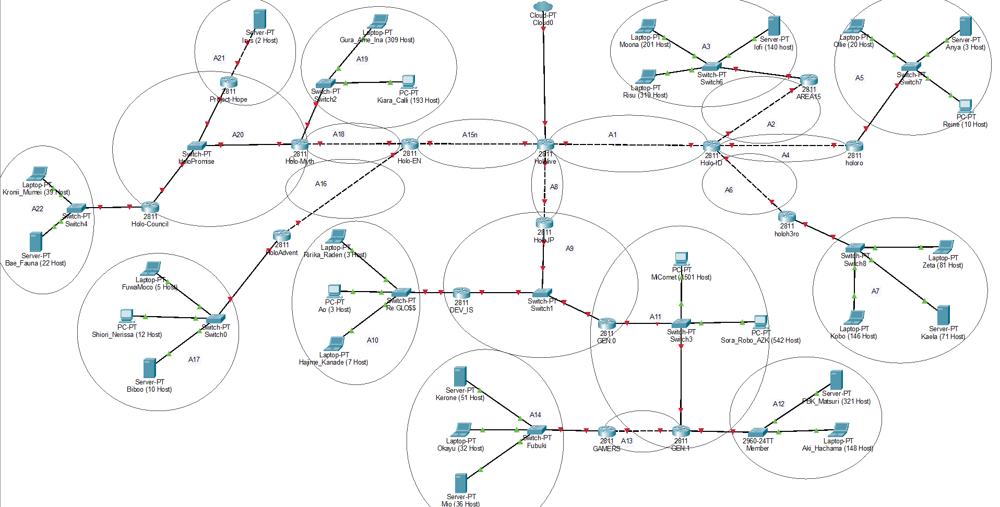
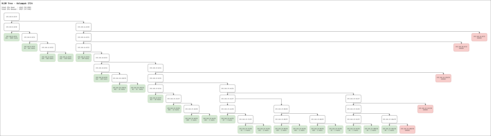

# Jarkom-Modul-4-IT24-2024

| Nama | NRP |
|---|---|
|Amoes Noland|5027231028|
|Radella Chesa Syaharani|5027231064|

## Daftar Isi

- [Jarkom-Modul-4-IT24-2024](#jarkom-modul-4-it24-2024)
  - [Daftar Isi](#daftar-isi)
  - [Pendahuluan](#pendahuluan)
  - [Topologi](#topologi)
      - [Topologi GNS3 CIDR](#topologi-gns3-cidr)
      - [Topologi CPT VLSM](#topologi-cpt-vlsm)
  - [Routing Table](#routing-table)
  - [Subnetting GNS - Metode CIDR](#subnetting-gns---metode-cidr)
    - [Penggabungan IP](#penggabungan-ip)
    - [Tree CIDR](#tree-cidr)
    - [Pembagian IP](#pembagian-ip)
    - [Routing](#routing)
    - [Testing](#testing)
  - [Subnetting Cisco Packet Tracer - Metode VLSM](#subnetting-cisco-packet-tracer---metode-vlsm)
    - [Tree VLSM](#tree-vlsm)
    - [Pembagian IP](#pembagian-ip-1)
    - [Konfigurasi Subnetting](#konfigurasi-subnetting)
      - [Subnet A1](#subnet-a1)
      - [Subnet A2](#subnet-a2)
      - [Subnet A3](#subnet-a3)
      - [Subnet A4](#subnet-a4)
      - [Subnet A5](#subnet-a5)
      - [Subnet A6](#subnet-a6)
      - [Subnet A7](#subnet-a7)
      - [Subnet A8](#subnet-a8)
      - [Subnet A9](#subnet-a9)
      - [Subnet A10](#subnet-a10)
      - [Subnet A11](#subnet-a11)
      - [Subnet A12](#subnet-a12)
      - [Subnet A13](#subnet-a13)
      - [Subnet A14](#subnet-a14)
      - [Subnet A15](#subnet-a15)
      - [Subnet A16](#subnet-a16)
      - [Subnet A17](#subnet-a17)
      - [Subnet A18](#subnet-a18)
      - [Subnet A19](#subnet-a19)
      - [Subnet A20](#subnet-a20)
      - [Subnet A21](#subnet-a21)
      - [Subnet A22](#subnet-a22)
    - [Konfigurasi Routing](#konfigurasi-routing)
    - [Testing](#testing-1)

## Pendahuluan

## Topologi
#### Topologi GNS3 CIDR


#### Topologi CPT VLSM


## Routing Table

| Nama Subnet | Rute | Jumlah IP | Netmask |
|---|---|---|---|
| A1 | Hololive > HoloID | 2 | /30 |
| A2 | Hololive > HoloID > AREA-15 | 2 | /30 |
| A3 | Hololive > HoloID > AREA-15 > Switch6 > Moona + Risu + lofi | 661 | /22 |
| A4 | Hololive > HoloID > holoro | 2 | /30 |
| A5 | Hololive > HoloID > holoro > Switch7 > Ollie + Anya + Reine | 34 | /26 |
| A6 | Hololive > HoloID > holoh3ro | 2 | /30 |
| A7 | Hololive > HoloID > holoh3ro > Switch8 > Zeta + Kaela + Kobo | 299 | /23 |
| A8 | Hololive > HoloJP | 2 | /30 |
| A9 | Hololive > HoloJP > Switch1 > DEV_IS + GEN:0 | 3 | /29 |
| A10 | Hololive > HoloJP > Switch1 > DEV_IS > Re:Gloss > Ririka_Raden + Ao + Hajime_Kanade | 14 | /28 |
| A11 | Hololive > HoloJP > Switch1 > GEN:0 > Switch3 > MiComet + Sora_Robo_AZK + GEN:1 | 2045 | /21 |
| A12 | Hololive > HoloJP > Switch1 > GEN:0 > Switch3 > GEN:1 > Member > FBK_Matsuri + Aki_Hachama | 470 | /23 |
| A13 | Hololive > HoloJP > Switch1 > GEN:0 > Switch3 > GEN:1 > GAMERS | 2 | /30 |
| A14 | Hololive > HoloJP > Switch1 > GEN:0 > Switch3 > GEN:1 > GAMERS > Fubuki > Korone + Okayu + Mio | 120 | /25 |
| A15 | Hololive > HoloEN | 2 | /30 |
| A16 | Hololive > HoloEN > HoloAdvent | 2 | /30 |
| A17 | Hololive > HoloEN > HoloAdvent > Switch0 > FuwaMoco + Shiori_Nerissa + Biboo | 28 | /27 |
| A18 | Hololive > HoloEN > Holo-Myth | 2 | /30 |
| A19 | Hololive > HoloEN > Holo-Myth > Switch2 > Gura_Ame_Ina + Kiara_Calli | 503 | /23 |
| A20 | Hololive > HoloEN > Holo-Myth > HoloPromise > Project-Hope + Holo_Council | 3 | /29 |
| A21 | Hololive > HoloEN > Holo-Myth > HoloPromise > Project-Hope > Irys | 3 | /29 |
| A22 | Hololive > HoloEN > Holo-Myth > HoloPromise > Holo-Council > Switch4 > Kronii_Mumei + Bae_Fauna | 62 | /26 |
| Total | | 4263 | /19 |

## Subnetting GNS - Metode CIDR

### Penggabungan IP

### Tree CIDR

### Pembagian IP

### Routing

### Testing

## Subnetting Cisco Packet Tracer - Metode VLSM

### Tree VLSM



### Pembagian IP

**Info :**
* Used IPs : 4263 (52.05%)
* Unused IPs : 3927 (47.94%)

Subnet | Network ID | Netmask | Broadcast | Range IP
|---|---|---|---|---|
A1 | 192.245.19.72 | 255.255.255.252 | 192.245.19.75 | 192.245.19.73 - 192.245.19.74
A2 | 192.245.19.92 | 255.255.255.252 | 192.245.19.95 | 192.245.19.93 - 192.245.19.94
A3 | 192.245.8.0 | 255.255.252.0 | 192.245.11.255 | 192.245.8.1 - 192.245.11.254
A4 | 192.245.19.96 | 255.255.255.252 | 192.245.19.99 | 192.245.19.97 - 192.245.19.98
A5 | 192.245.18.192 | 255.255.255.192 | 192.245.18.255 | 192.245.18.193 - 192.245.18.254
A6 | 192.245.19.100 | 255.255.255.252 | 192.245.19.103 | 192.245.19.101 - 192.245.19.102
A7 | 192.245.16.0 | 255.255.254.0 | 192.245.17.255 | 192.245.16.1 - 192.245.17.254
A8 | 192.245.19.104 | 255.255.255.252 | 192.245.19.107 | 192.245.19.105 - 192.245.19.106
A9 | 192.245.19.64 | 255.255.255.248 | 192.245.19.71 | 192.245.19.65 - 192.245.19.70
A10 | 192.245.19.32 | 255.255.255.240 | 192.245.19.47 | 192.245.19.33 - 192.245.19.46
A11 | 192.245.0.0 | 255.255.248.0 | 192.245.7.255 | 192.245.0.1 - 192.245.7.254
A12 | 192.245.14.0 | 255.255.254.0 | 192.245.15.255 | 192.245.14.1 - 192.245.15.254
A13 | 192.245.19.76 | 255.255.255.252 | 192.245.19.79 | 192.245.19.77 - 192.245.19.78
A14 | 192.245.18.0 | 255.255.255.128 | 192.245.18.127 | 192.245.18.1 - 192.245.18.126
A15 | 192.245.19.80 | 255.255.255.252 | 192.245.19.83 | 192.245.19.81 - 192.245.19.82
A16 | 192.245.19.84 | 255.255.255.252 | 192.245.19.87 | 192.245.19.85 - 192.245.19.86
A17 | 192.245.19.0 | 255.255.255.224 | 192.245.19.31 | 192.245.19.1 - 192.245.19.30
A18 | 192.245.19.88 | 255.255.255.252 | 192.245.19.91 | 192.245.19.89 - 192.245.19.90
A19 | 192.245.12.0 | 255.255.254.0 | 192.245.13.255 | 192.245.12.1 - 192.245.13.254
A20 | 192.245.19.48 | 255.255.255.248 | 192.245.19.55 | 192.245.19.49 - 192.245.19.54
A21 | 192.245.19.56 | 255.255.255.248 | 192.245.19.63 | 192.245.19.57 - 192.245.19.62
A22 | 192.245.18.128 | 255.255.255.192 | 192.245.18.191 | 192.245.18.129 - 192.245.18.190

### Konfigurasi Subnetting

#### Subnet A1

**Hololive (Router)**
```
interface fa0/1
ip address 192.245.19.73 255.255.255.252
no shutdown
```

**Holo-ID (Router)**
```
interface fa0/0
ip address 192.245.19.74 255.255.255.252
no shutdown
```

#### Subnet A2

**Holo-ID (Router)**
```
interface fa0/1
ip address 192.245.19.93 255.255.255.252
no shutdown
```

**AREA15 (Router)**
```
interface fa0/0
ip address 192.245.19.94 255.255.255.252
no shutdown
```

#### Subnet A3

**AREA15 (Router)**
```
interface fa0/1
ip address 192.245.8.1 255.255.252.0
no shutdown
```

**Moona (Device)**
```
Interface fa0
IP Address: 192.245.8.2
Subnet Mask: 255.255.252.0
Gateway: 192.245.8.1
```

**Risu (Device)**
```
Interface fa0
IP Address: 192.245.8.3
Subnet Mask: 255.255.252.0
Gateway: 192.245.8.1
```
**lofi (Device)**
```
Interface fa0
IP Address: 192.245.8.4
Subnet Mask: 255.255.252.0
Gateway: 192.245.8.1
```

#### Subnet A4

**Holo-ID (Router)**
```
interface fa1/0
ip address 192.245.19.97 255.255.255.252
no shutdown
```

**holoro (Router)**
```
interface fa0/0
ip address 192.245.19.98 255.255.255.252
no shutdown
```

#### Subnet A5

**holoro (Router)**
```
interface fa0/1
ip address 192.245.18.193 255.255.255.192
no shutdown
```

**Ollie (Device)**
```
Interface fa0
IP Address: 192.245.18.194
Subnet Mask: 255.255.255.192
Gateway: 192.245.18.193
```

**Anya (Device)**
```
Interface fa0
IP Address: 192.245.18.195
Subnet Mask: 255.255.255.192
Gateway: 192.245.18.193
```
**Reine (Device)**
```
Interface fa0
IP Address: 192.245.18.196
Subnet Mask: 255.255.255.192
Gateway: 192.245.18.193
```

#### Subnet A6

**Holo-ID (Router)**
```
interface fa1/1
ip address 192.245.19.101 255.255.255.252
no shutdown
```

**holoh3ro (Router)**
```
interface fa0/0
ip address 192.245.19.102 255.255.255.252
no shutdown
```

#### Subnet A7

**holoh3ro (Router)**
```
interface fa0/1
ip address 192.245.16.1 255.255.254.0
no shutdown
```

**Zeta (Device)**
```
Interface fa0
IP Address: 192.245.16.2
Subnet Mask: 255.255.254.0
Gateway: 192.245.16.1
```

**Kaela (Device)**
```
Interface fa0
IP Address: 192.245.16.3
Subnet Mask: 255.255.254.0
Gateway: 192.245.16.1
```

**Kobo (Device)**
```
Interface fa0
IP Address: 192.245.16.4
Subnet Mask: 255.255.254.0
Gateway: 192.245.16.1
```

#### Subnet A8

**Hololive (Router)**
```
interface fa1/0
ip address 192.245.19.105 255.255.255.252
no shutdown
```

**HoloJP (Router)**
```
interface fa0/1
ip address 192.245.19.106 255.255.255.252
no shutdown
```

#### Subnet A9

**HoloJP (Router)**
```
interface fa0/0
ip address 192.245.19.65 255.255.255.248
no shutdown
```

**DEV_IS (Router)**
```
interface fa0/0
ip address 192.245.19.66 255.255.255.248
no shutdown
```

**GEN:0 (Router)**
```
interface fa0/0
ip address 192.245.19.67 255.255.255.248
no shutdown
```

#### Subnet A10

**DEV_IS (Router)**
```
interface fa0/1
ip address 192.245.19.33 255.255.255.240
no shutdown
```

**Ririka_Rade (Device)**
```
Interface fa0
IP Address: 192.245.19.34
Subnet Mask: 255.255.255.240
Gateway: 192.245.19.33
```

**Ao (Device)**
```
Interface fa0
IP Address: 192.245.19.35
Subnet Mask: 255.255.255.240
Gateway: 192.245.19.33
```

**Hajime_Kanade (Device)**
```
Interface fa0
IP Address: 192.245.19.36
Subnet Mask: 255.255.255.240
Gateway: 192.245.19.33
```

#### Subnet A11

**GEN:0 (Router)**
```
interface fa0/1
ip address 192.245.0.1 255.255.248.0
no shutdown
```

**GEN:1 (Router)**
```
interface fa0/0
ip address 192.245.0.2 255.255.248.0
no shutdown
```

**MiComet (Device)**
```
Interface fa0
IP Address: 192.245.0.3
Subnet Mask: 255.255.248.0
Gateway: 192.245.0.1
```

**Sora_Robo_AZK (Device)**
```
Interface fa0
IP Address: 192.245.0.4
Subnet Mask: 255.255.248.0
Gateway: 192.245.0.1
```


#### Subnet A12

**GEN:1 (Router)**
```
interface fa0/1
ip address 192.245.14.1 255.255.254.0
no shutdown
```

**FBK_Matsuri (Device)**
```
Interface fa0
IP Address: 192.245.14.2
Subnet Mask: 255.255.254.0
Gateway: 192.245.14.1
```

**Aki_Hachama (Device)**
```
Interface fa0
IP Address: 192.245.14.2
Subnet Mask: 255.255.254.0
Gateway: 192.245.14.1
```

#### Subnet A13

**GEN:1 (Router)**
```
interface fa1/0
ip address 192.245.19.77 255.255.255.252
no shutdown
```

**GAMERS (Router)**
```
interface fa0/0
ip address 192.245.19.78 255.255.255.252
no shutdown
```

#### Subnet A14

**GAMERS (Router)**
```
interface fa0/1
ip address 192.245.18.1 255.255.255.128
no shutdown
```

**Kerone (Device)**
```
Interface fa0
IP Address: 192.245.18.2
Subnet Mask: 255.255.255.128
Gateway: 192.245.18.1
```

**Okayu (Device)**
```
Interface fa0
IP Address: 192.245.18.3
Subnet Mask: 255.255.255.128
Gateway: 192.245.18.1
```

**Mio (Device)**
```
Interface fa0
IP Address: 192.245.18.4
Subnet Mask: 255.255.255.128
Gateway: 192.245.18.1
```

#### Subnet A15

**Hololive (Router)**
```
interface fa1/1
ip address 192.245.19.81 255.255.255.252
no shutdown
```

**HoloEN (Router)**
```
interface fa0/0
ip address 192.245.19.82 255.255.255.252
no shutdown
```

#### Subnet A16

**HoloEN (Router)**
```
interface fa0/1
ip address 192.245.19.85 255.255.255.252
no shutdown
```

**HoloAdvent (Router)**
```
interface fa0/0
ip address 192.245.19.86 255.255.255.252
no shutdown
```

#### Subnet A17

**HoloAdvent (Router)**
```
interface fa0/1
ip address 192.245.19.1 255.255.255.224
no shutdown
```

**FuwaMoco (Device)**
```
Interface fa0
IP Address: 192.245.19.2
Subnet Mask: 255.255.224.0
Gateway: 192.245.19.1
```

**Shiori_Nerissa (Device)**
```
Interface fa0
IP Address: 192.245.19.3
Subnet Mask: 255.255.224.0
Gateway: 192.245.19.1
```

**Biboo (Device)**
```
Interface fa0
IP Address: 192.245.19.4
Subnet Mask: 255.255.224.0
Gateway: 192.245.19.1
```

#### Subnet A18

**HoloEN (Router)**
```
interface fa1/0
ip address 192.245.19.89 255.255.255.252
no shutdown
```

**Holo-Myth (Router)**
```
interface fa0/0
ip address 192.245.19.90 255.255.255.252
no shutdown
```

#### Subnet A19

**Holo-Myth (Router)**
```
interface fa0/1
ip address 192.245.12.1 255.255.254.0
no shutdown
```

**Gura_Ame_Ina (Device)**
```
Interface fa0
IP Address: 192.245.12.2
Subnet Mask: 255.255.254.0
Gateway: 192.245.12.1
```

**Kiara_Calli (Device)**
```
Interface fa0
IP Address: 192.245.12.3
Subnet Mask: 255.255.254.0
Gateway: 192.245.12.1
```

#### Subnet A20

**Holo-Myth (Router)**
```
interface fa1/0
ip address 192.245.19.49 255.255.255.248
no shutdown
```

**Project-Hope (Router)**
```
interface fa0/0
ip address 192.245.19.50 255.255.255.248
no shutdown
```

**Holo-Council (Router)**
```
interface fa0/0
ip address 192.245.19.51 255.255.255.248
no shutdown
```

#### Subnet A21

**Project-Hope (Router)**
```
interface fa0/1
ip address 192.245.19.57 255.255.255.248
no shutdown
```

**Irys (Device)**
```
Interface fa0
IP Address: 192.245.19.58
Subnet Mask: 255.255.255.248
Gateway: 192.245.19.57
```

#### Subnet A22

**Holo-Council (Router)**
```
interface fa0/1
ip address 192.245.18.129 255.255.255.192
no shutdown
```

**Kronii_Mumei (Device)**
```
Interface fa0
IP Address: 192.245.18.130
Subnet Mask: 255.255.255.192
Gateway: 192.245.18.129
```

**Bae_Fauna (Device)**
```
Interface fa0
IP Address: 192.245.18.131
Subnet Mask: 255.255.255.192
Gateway: 192.245.18.129
```

### Konfigurasi Routing

### Testing