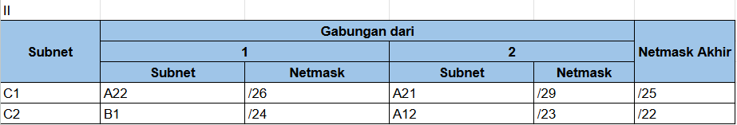
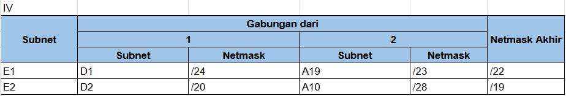
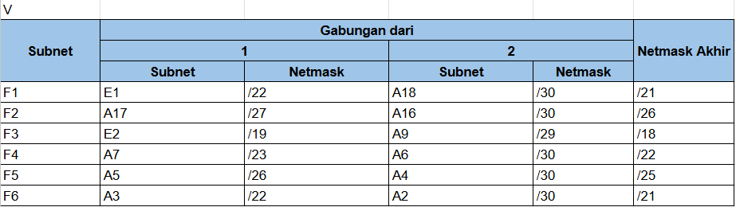
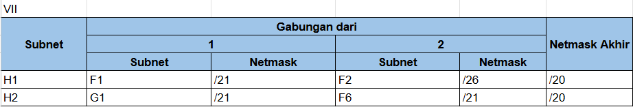
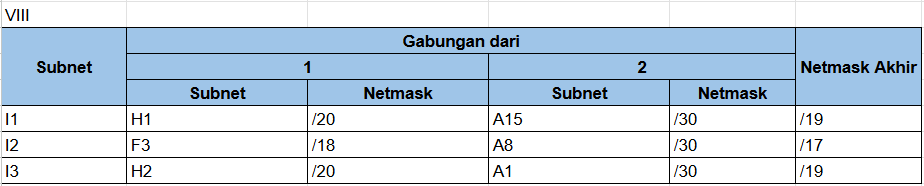
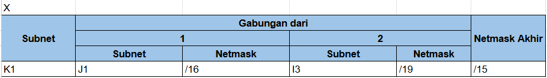

# Jarkom-Modul-4-IT24-2024

| Nama | NRP |
|---|---|
|Amoes Noland|5027231028|
|Radella Chesa Syaharani|5027231064|

## Daftar Isi

- [Jarkom-Modul-4-IT24-2024](#jarkom-modul-4-it24-2024)
  - [Daftar Isi](#daftar-isi)
  - [Pendahuluan](#pendahuluan)
  - [Topologi](#topologi)
      - [Topologi GNS3 CIDR](#topologi-gns3-cidr)
      - [Topologi CPT VLSM](#topologi-cpt-vlsm)
  - [Routing Table](#routing-table)
  - [Subnetting GNS - Metode CIDR](#subnetting-gns---metode-cidr)
    - [Penggabungan IP](#penggabungan-ip)
    - [Tree CIDR](#tree-cidr)
    - [Pembagian IP](#pembagian-ip)
    - [Routing](#routing)
    - [Testing](#testing)
  - [Subnetting Cisco Packet Tracer - Metode VLSM](#subnetting-cisco-packet-tracer---metode-vlsm)
    - [Tree VLSM](#tree-vlsm)
    - [Pembagian IP](#pembagian-ip-1)
    - [Konfigurasi Subnetting](#konfigurasi-subnetting)
      - [Subnet A1](#subnet-a1)
      - [Subnet A2](#subnet-a2)
      - [Subnet A3](#subnet-a3)
      - [Subnet A4](#subnet-a4)
      - [Subnet A5](#subnet-a5)
      - [Subnet A6](#subnet-a6)
      - [Subnet A7](#subnet-a7)
      - [Subnet A8](#subnet-a8)
      - [Subnet A9](#subnet-a9)
      - [Subnet A10](#subnet-a10)
      - [Subnet A11](#subnet-a11)
      - [Subnet A12](#subnet-a12)
      - [Subnet A13](#subnet-a13)
      - [Subnet A14](#subnet-a14)
      - [Subnet A15](#subnet-a15)
      - [Subnet A16](#subnet-a16)
      - [Subnet A17](#subnet-a17)
      - [Subnet A18](#subnet-a18)
      - [Subnet A19](#subnet-a19)
      - [Subnet A20](#subnet-a20)
      - [Subnet A21](#subnet-a21)
      - [Subnet A22](#subnet-a22)
    - [Konfigurasi Routing](#konfigurasi-routing)
      - [Sisi Kanan (Holo-ID)](#sisi-kanan-holo-id)
        - [Hololive](#hololive)
        - [Holo-ID](#holo-id)
        - [AREA15](#area15)
        - [holoro](#holoro)
        - [holoh3ro](#holoh3ro)
      - [Sisi Bawah (HoloJP)](#sisi-bawah-holojp)
        - [Hololive](#hololive-1)
        - [HoloJP](#holojp)
        - [DEV\_IS](#dev_is)
        - [GEN:0](#gen0)
        - [GEN:1](#gen1)
        - [GAMERS](#gamers)
      - [Sisi Kiri (HoloEN)](#sisi-kiri-holoen)
        - [Hololive](#hololive-2)
        - [HoloEN](#holoen)
        - [HoloAdvent](#holoadvent)
        - [Holo-Myth](#holo-myth)
        - [Project-Hope](#project-hope)
        - [Holo-Council](#holo-council)
    - [Testing](#testing-1)
      - [Device to Device](#device-to-device)
      - [Router to Router](#router-to-router)

## Pendahuluan

## Topologi
#### Topologi GNS3 CIDR


#### Topologi CPT VLSM


## Routing Table

| Nama Subnet | Rute | Jumlah IP | Netmask |
|---|---|---|---|
| A1 | Hololive > HoloID | 2 | /30 |
| A2 | Hololive > HoloID > AREA-15 | 2 | /30 |
| A3 | Hololive > HoloID > AREA-15 > Switch6 > Moona + Risu + lofi | 661 | /22 |
| A4 | Hololive > HoloID > holoro | 2 | /30 |
| A5 | Hololive > HoloID > holoro > Switch7 > Ollie + Anya + Reine | 34 | /26 |
| A6 | Hololive > HoloID > holoh3ro | 2 | /30 |
| A7 | Hololive > HoloID > holoh3ro > Switch8 > Zeta + Kaela + Kobo | 299 | /23 |
| A8 | Hololive > HoloJP | 2 | /30 |
| A9 | Hololive > HoloJP > Switch1 > DEV_IS + GEN:0 | 3 | /29 |
| A10 | Hololive > HoloJP > Switch1 > DEV_IS > Re:Gloss > Ririka_Raden + Ao + Hajime_Kanade | 14 | /28 |
| A11 | Hololive > HoloJP > Switch1 > GEN:0 > Switch3 > MiComet + Sora_Robo_AZK + GEN:1 | 2045 | /21 |
| A12 | Hololive > HoloJP > Switch1 > GEN:0 > Switch3 > GEN:1 > Member > FBK_Matsuri + Aki_Hachama | 470 | /23 |
| A13 | Hololive > HoloJP > Switch1 > GEN:0 > Switch3 > GEN:1 > GAMERS | 2 | /30 |
| A14 | Hololive > HoloJP > Switch1 > GEN:0 > Switch3 > GEN:1 > GAMERS > Fubuki > Korone + Okayu + Mio | 120 | /25 |
| A15 | Hololive > HoloEN | 2 | /30 |
| A16 | Hololive > HoloEN > HoloAdvent | 2 | /30 |
| A17 | Hololive > HoloEN > HoloAdvent > Switch0 > FuwaMoco + Shiori_Nerissa + Biboo | 28 | /27 |
| A18 | Hololive > HoloEN > Holo-Myth | 2 | /30 |
| A19 | Hololive > HoloEN > Holo-Myth > Switch2 > Gura_Ame_Ina + Kiara_Calli | 503 | /23 |
| A20 | Hololive > HoloEN > Holo-Myth > HoloPromise > Project-Hope + Holo_Council | 3 | /29 |
| A21 | Hololive > HoloEN > Holo-Myth > HoloPromise > Project-Hope > Irys | 3 | /29 |
| A22 | Hololive > HoloEN > Holo-Myth > HoloPromise > Holo-Council > Switch4 > Kronii_Mumei + Bae_Fauna | 62 | /26 |
| Total | | 4263 | /19 |

## Subnetting GNS - Metode CIDR

### Penggabungan IP
1. Penggabungan I (B)


2. Penggabungan II (C)



3. Penggabungan III (D)


4. Penggabungan IV (E)



5. Penggabungan V (F)



6. Penggabungan VI (G)


7. Penggabungan VII (H)



8. Penggabungan VIII (I)



9. Penggabungan IX (J)


10. Penggabungan X (K)


### Tree CIDR

### Pembagian IP
Subnet | Network ID | Netmask | Broadcast | Range IP
|---|---|---|---|---|
A1 |	192.246.16.0 |	255.255.255.252 |	192.246.16.3 |	192.246.16.1 - 192.246.16.2
A2 |	192.246.12.0 |	255.255.255.252 |	192.246.12.3 |	192.246.12.1 - 192.246.12.2
A3 |	192.246.8.0 |	255.255.252.0 |	192.246.11.255 |	192.246.8.1 - 192.246.11.254
A4 |	192.246.4.64 |	255.255.255.252 |	192.246.4.67 |	192.246.4.65 - 192.246.4.66
A5 |	192.246.4.0 |	255.255.255.192 |	192.246.4.63 |	192.246.4.1 - 192.246.4.62
A6 |	192.246.2.0 |	255.255.255.252 |	192.246.2.3 |	192.246.2.1 - 192.246.2.2
A7 |	192.246.0.0 |	255.255.254.0 |	192.246.1.255 |	192.246.0.1 - 192.246.1.254
A8 |	192.245.64.0 |	255.255.255.252 |	192.245.64.3 |	192.245.64.1 - 192.245.64.2
A9 |	192.245.32.0 |	255.255.255.248 |	192.245.32.7 |	192.245.32.1 - 192.245.32.6
A10 |	192.245.16.0 |	255.255.255.240 |	192.245.16.15 |	192.245.16.1 - 192.245.16.14
A11 |	192.245.0.0 |	255.255.248.0 |	192.245.7.255 |	192.245.0.1 - 192.245.7.254
A12 |	192.245.8.0 |	255.255.254.0 |	192.245.9.255 |	192.245.8.1 - 192.245.9.254
A13 |	192.245.10.128 |	255.255.255.252 |	192.245.10.131 |	192.245.10.129 - 192.245.10.130
A14 |	192.245.10.0 |	255.255.255.128 |	192.245.10.127 |	192.245.10.1 - 192.245.10.126
A15 |	192.245.144.0 |	255.255.255.252 |	192.245.144.3 |	192.245.144.1 - 192.245.144.2
A16 |	192.245.136.32 |	255.255.255.252 |	192.245.136.35 |	192.245.136.33 - 192.245.136.34
A17 |	192.245.136.0 |	255.255.255.224 |	192.245.136.31 |	192.245.136.1 - 192.245.136.30
A18 |	192.245.132.0 |	255.255.255.252 |	192.245.132.3 |	192.245.132.1 - 192.245.132.2
A19 |	192.245.128.0 |	255.255.254.0 |	192.245.129.255 |	192.245.128.1 - 192.245.129.254
A20 |	192.245.130.128 |	255.255.255.248 |	192.245.130.135 |	192.245.130.129 - 192.245.130.134
A21 |	192.245.130.64 |	255.255.255.248 |	192.245.130.71 |	192.245.130.65 - 192.245.130.70
A22 |	192.245.130.0 |	255.255.255.192 |	192.245.130.63 |	192.245.130.1 - 192.245.130.62
### Konfigurasi Subnetting
#### Subnet A1
**Hololive (Router)**
```
auto eth2
iface eth2 inet static
    address 192.246.16.1
    netmask 255.255.255.252
```
**Holo-ID (Router)**
```
auto eth0
iface eth0 inet static
    address 192.246.16.2
    netmask 255.255.255.252
```

#### Subnet A2
**Holo-ID (Router)**
```
auto eth1
iface eth1 inet static
    address 192.246.12.1
    netmask 255.255.255.252
```
**AREA15 (Router)**
```
auto eth0
iface eth0 inet static
    address 192.246.12.2
    netmask 255.255.255.252
```
#### Subnet A3
**AREA15 (Router)**
```
auto eth1
iface eth1 inet static
    address 192.246.8.1
    netmask 255.255.252.0
```
**Risu (Client)**
```
auto eth0
iface eth0 inet static
    address 192.246.8.2
    netmask 255.255.252.0
    gateway 192.246.8.1
```
**Moona (Client)**
```
auto eth0
iface eth0 inet static
    address 192.246.8.3
    netmask 255.255.252.0
    gateway 192.246.8.1
```
**Iofi (Client)**
```
auto eth0
iface eth0 inet static
    address 192.246.8.4
    netmask 255.255.252.0
    gateway 192.246.8.1
```

#### Subnet A4
**Holo-ID (Router)**
```
auto eth2
iface eth2 inet static
    address 192.246.4.65
    netmask 255.255.255.252
```
**holoro (Router)**
```
auto eth0
iface eth0 inet static
    address 192.246.4.66
    netmask 255.255.255.252
```

#### Subnet A5
**holoro (Router)**
```
auto eth1
iface eth1 inet static
    address 192.246.4.1
    netmask 255.255.255.192
```
**Ollie (Client)**
```
auto eth0
iface eth0 inet static
    address 192.246.4.2
    netmask 255.255.255.192
    gateway 192.246.4.1
```
**Anya (Client)**
```
auto eth0
iface eth0 inet static
    address 192.246.4.3
    netmask 255.255.255.192
    gateway 192.246.4.1
```
**Reine (Client)**
```
auto eth0
iface eth0 inet static
    address 192.246.4.4
    netmask 255.255.255.192
    gateway 192.246.4.1
```

#### Subnet A6
**Holo-ID (Router)**
```
auto eth3
iface eth3 inet static
    address 192.246.2.1
    netmask 255.255.255.252
```
**holoh3ro (Router)**
```
auto eth0
iface eth0 inet static
    address 192.246.2.2
    netmask 255.255.255.252
```

#### Subnet A7
**holoh3ro (Router)**
```
auto eth1
iface eth1 inet static
    address 192.246.0.1
    netmask 255.255.254.0
```
**Zeta (Client)**
```
auto eth0
iface eth0 inet static
    address 192.246.0.2
    netmask 255.255.254.0
    gateway 192.246.0.1
```
**Kaela (Client)**
```
auto eth0
iface eth0 inet static
    address 192.246.0.3
    netmask 255.255.254.0
    gateway 192.246.0.1
```
**Kobo (Client)**
```
auto eth0
iface eth0 inet static
    address 192.246.0.4
    netmask 255.255.254.0
    gateway 192.246.0.1
```

#### Subnet A8
**Hololive (Router)**
```
auto eth3
iface eth3 inet static
    address 192.245.64.1
    netmask 255.255.255.252
```
**Holo-JP (Router)**
```
auto eth0
iface eth0 inet static
    address 192.245.64.2
    netmask 255.255.255.252
```

#### Subnet A9
**Holo-JP (Router)**
```
auto eth1
iface eth1 inet static
    address 192.245.32.1
    netmask 255.255.255.248
```
**DEV_IS (Router)**
```
auto eth0
iface eth0 inet static
    address 192.245.32.2
    netmask 255.255.255.248
```
**GEN:0 (Router)**
```
auto eth0
iface eth0 inet static
    address 192.245.32.3
    netmask 255.255.255.248
```

#### Subnet A10
**DEV_IS (Router)**
```
auto eth1
iface eth1 inet static
    address 192.245.16.1
    netmask 255.255.255.240
```
**Ririka_Raden (Client)**
```
auto eth0
iface eth0 inet static
    address 192.245.16.2
    netmask 255.255.255.240
    gateway 192.245.16.1
```
**Ao (Client)**
```
auto eth0
iface eth0 inet static
    address 192.245.16.3
    netmask 255.255.255.240
    gateway 192.245.16.1
```
**Hajime_Kanade (Client)**
```
auto eth0
iface eth0 inet static
    address 192.245.16.4
    netmask 255.255.255.240
    gateway 192.245.16.1
```
#### Subnet A11
**GEN:0 (Router)**
```
auto eth1
iface eth1 inet static
    address 192.245.0.1
    netmask 255.255.248.0
```
**GEN:1 (Router)**
```
auto eth0
iface eth0 inet static
    address 192.245.0.2
    netmask 255.255.248.0
```
**MiComet (Client)**
```
auto eth0
iface eth0 inet static
    address 192.245.0.3
    netmask 255.255.248.0
    gateway 192.245.0.1
```
**Sora_Robo_AZKI (Client)**
```
auto eth0
iface eth0 inet static
    address 192.245.0.4
    netmask 255.255.248.0
    gateway 192.245.0.1
```

#### Subnet A12
**GEN:1 (Router)**
```
auto eth1
iface eth1 inet static
    address 192.245.8.1
    netmask 255.255.254.0
```
**FBK_Matsuri (Client)**
```
auto eth1
iface eth1 inet static
    address 192.245.8.2
    netmask 255.255.254.0
    gateway 192.245.8.1
```
**Aki_Hachama (Client)**
```
auto eth1
iface eth1 inet static
    address 192.245.8.3
    netmask 255.255.254.0
    gateway 192.245.8.1
```

#### Subnet A13
**GEN:1 (Router)**
```
auto eth2
iface eth2 inet static
    address 192.245.10.129
    netmask 255.255.255.252
```
**GAMERS (Router)**
```
auto eth0
iface eth0 inet static
    address 192.245.10.130
    netmask 255.255.255.252
```

#### Subnet A14
**GAMERS (Router)**
```
auto eth1
iface eth1 inet static
    address 192.245.10.1
    netmask 255.255.255.128
```
**Korone (Client)**
```
auto eth0
iface eth0 inet static
    address 192.245.10.2
    netmask 255.255.255.128
    gateway 192.245.10.1
```
**Okayu (Client)**
```
auto eth0
iface eth0 inet static
    address 192.245.8.3
    netmask 255.255.255.128
    gateway 192.245.10.1
```
**Mio (Client)**
```
auto eth0
iface eth0 inet static
    address 192.245.8.4
    netmask 255.255.255.128
    gateway 192.245.10.1
```
#### Subnet A15
**Hololive (Router)**
```
auto eth1
iface eth1 inet static
    address 192.245.10.1
    netmask 255.255.255.252
```
**Holo-EN (Router)**
```
auto eth0
iface eth0 inet static
    address 192.245.10.2
    netmask 255.255.255.252
```

#### Subnet A16
**Holo-EN (Router)**
```
auto eth2
iface eth2 inet static
    address 192.245.136.32
    netmask 255.255.255.252
```
**HoloAdvent (Router)**
```
auto eth0
iface eth0 inet static
    address 192.245.136.33
    netmask 255.255.255.252
```

#### Subnet A17
**HoloAdvent (Router)**
```
auto eth0
iface eth0 inet static
    address 192.245.136.1
    netmask 255.255.255.224
```
**FuwaMoco (Client)**
```
auto eth0
iface eth0 inet static
    address 192.245.136.2
    netmask 255.255.255.224
    gateway 192.245.136.1
```
**Shiori_Nerissa (Client)**
```
auto eth0
iface eth0 inet static
    address 192.245.136.3
    netmask 255.255.255.224
    gateway 192.245.136.1
```
**Biboo (Client)**
```
auto eth0
iface eth0 inet static
    address 192.245.136.4
    netmask 255.255.255.224
    gateway 192.245.136.1
```

#### Subnet A18
**Holo-EN (Router)**
```
auto eth1
iface eth1 inet static
    address 192.245.132.1
    netmask 255.255.255.252
```
**Holo-Myth (Router)**
```
auto eth0
iface eth0 inet static
    address 192.245.132.2
    netmask 255.255.255.252
```

#### Subnet A19
**Holo-Myth (Router)**
```
auto eth1
iface eth1 inet static
    address 192.245.128.1
    netmask 255.255.254.0
```
**Gura_Ame_Ina (Client)**
```
auto eth0
iface eth0 inet static
    address 192.245.128.2
    netmask 255.255.254.0
    gateway 192.245.128.1
```
**Kiara_Calli (Client)**
```
auto eth0
iface eth0 inet static
    address 192.245.128.3
    netmask 255.255.254.0
    gateway 192.245.128.1
```

#### Subnet A20
**Holo-Myth (Router)**
```
auto eth2
iface eth2 inet static
    address 192.245.130.129
    netmask 255.255.255.248
```
**Project-Hope (Router)**
```
auto eth1
iface eth1 inet static
    address 192.245.130.130
    netmask 255.255.255.248
```
**Holo-Council (Router)**
```
auto eth0
iface eth0 inet static
    address 192.245.130.131
    netmask 255.255.255.248
```

#### Subnet A21
**Project-Hope (Router)**
```
auto eth0
iface eth0 inet static
    address 192.245.130.65
    netmask 255.255.255.248
```
**Irys (Client)**
```
auto eth0
iface eth0 inet static
    address 192.245.130.66
    netmask 255.255.255.248
    gateway 192.245.130.65
```

#### Subnet A22
**Holo-Council (Router)**
```
auto eth1
iface eth1 inet static
    address 192.245.130.1
    netmask 255.255.255.192
```
**Kronii_Mumei (Client)**
```
auto eth0
iface eth0 inet static
    address 192.245.130.2
    netmask 255.255.255.248
    gateway 192.245.130.1
```
**Bae_Fauna (Client)**
```
auto eth0
iface eth0 inet static
    address 192.245.130.3
    netmask 255.255.255.248
    gateway 192.245.130.1
```

### Testing

## Subnetting Cisco Packet Tracer - Metode VLSM

### Tree VLSM


### Pembagian IP

**Info :**
* Used IPs : 4263 (52.05%)
* Unused IPs : 3927 (47.94%)

Subnet | Network ID | Netmask | Broadcast | Range IP
|---|---|---|---|---|
A1 | 192.245.19.72 | 255.255.255.252 | 192.245.19.75 | 192.245.19.73 - 192.245.19.74
A2 | 192.245.19.92 | 255.255.255.252 | 192.245.19.95 | 192.245.19.93 - 192.245.19.94
A3 | 192.245.8.0 | 255.255.252.0 | 192.245.11.255 | 192.245.8.1 - 192.245.11.254
A4 | 192.245.19.96 | 255.255.255.252 | 192.245.19.99 | 192.245.19.97 - 192.245.19.98
A5 | 192.245.18.192 | 255.255.255.192 | 192.245.18.255 | 192.245.18.193 - 192.245.18.254
A6 | 192.245.19.100 | 255.255.255.252 | 192.245.19.103 | 192.245.19.101 - 192.245.19.102
A7 | 192.245.16.0 | 255.255.254.0 | 192.245.17.255 | 192.245.16.1 - 192.245.17.254
A8 | 192.245.19.104 | 255.255.255.252 | 192.245.19.107 | 192.245.19.105 - 192.245.19.106
A9 | 192.245.19.64 | 255.255.255.248 | 192.245.19.71 | 192.245.19.65 - 192.245.19.70
A10 | 192.245.19.32 | 255.255.255.240 | 192.245.19.47 | 192.245.19.33 - 192.245.19.46
A11 | 192.245.0.0 | 255.255.248.0 | 192.245.7.255 | 192.245.0.1 - 192.245.7.254
A12 | 192.245.14.0 | 255.255.254.0 | 192.245.15.255 | 192.245.14.1 - 192.245.15.254
A13 | 192.245.19.76 | 255.255.255.252 | 192.245.19.79 | 192.245.19.77 - 192.245.19.78
A14 | 192.245.18.0 | 255.255.255.128 | 192.245.18.127 | 192.245.18.1 - 192.245.18.126
A15 | 192.245.19.80 | 255.255.255.252 | 192.245.19.83 | 192.245.19.81 - 192.245.19.82
A16 | 192.245.19.84 | 255.255.255.252 | 192.245.19.87 | 192.245.19.85 - 192.245.19.86
A17 | 192.245.19.0 | 255.255.255.224 | 192.245.19.31 | 192.245.19.1 - 192.245.19.30
A18 | 192.245.19.88 | 255.255.255.252 | 192.245.19.91 | 192.245.19.89 - 192.245.19.90
A19 | 192.245.12.0 | 255.255.254.0 | 192.245.13.255 | 192.245.12.1 - 192.245.13.254
A20 | 192.245.19.48 | 255.255.255.248 | 192.245.19.55 | 192.245.19.49 - 192.245.19.54
A21 | 192.245.19.56 | 255.255.255.248 | 192.245.19.63 | 192.245.19.57 - 192.245.19.62
A22 | 192.245.18.128 | 255.255.255.192 | 192.245.18.191 | 192.245.18.129 - 192.245.18.190

### Konfigurasi Subnetting

#### Subnet A1

**Hololive (Router)**
```
enable
configure terminal
interface fa0/1
ip address 192.245.19.73 255.255.255.252
no shutdown
```

**Holo-ID (Router)**
```
enable
configure terminal
interface fa0/0
ip address 192.245.19.74 255.255.255.252
no shutdown
```

#### Subnet A2

**Holo-ID (Router)**
```
enable
configure terminal
interface fa0/1
ip address 192.245.19.93 255.255.255.252
no shutdown
```

**AREA15 (Router)**
```
enable
configure terminal
interface fa0/0
ip address 192.245.19.94 255.255.255.252
no shutdown
```

#### Subnet A3

**AREA15 (Router)**
```
enable
configure terminal
interface fa0/1
ip address 192.245.8.1 255.255.252.0
no shutdown
```

**Moona (Device)**
```
Interface fa0
IP Address: 192.245.8.2
Subnet Mask: 255.255.252.0
Gateway: 192.245.8.1
```

**Risu (Device)**
```
Interface fa0
IP Address: 192.245.8.3
Subnet Mask: 255.255.252.0
Gateway: 192.245.8.1
```
**lofi (Device)**
```
Interface fa0
IP Address: 192.245.8.4
Subnet Mask: 255.255.252.0
Gateway: 192.245.8.1
```

#### Subnet A4

**Holo-ID (Router)**
```
enable
configure terminal
interface fa1/0
ip address 192.245.19.97 255.255.255.252
no shutdown
```

**holoro (Router)**
```
enable
configure terminal
interface fa0/0
ip address 192.245.19.98 255.255.255.252
no shutdown
```

#### Subnet A5

**holoro (Router)**
```
enable
configure terminal
interface fa0/1
ip address 192.245.18.193 255.255.255.192
no shutdown
```

**Ollie (Device)**
```
Interface fa0
IP Address: 192.245.18.194
Subnet Mask: 255.255.255.192
Gateway: 192.245.18.193
```

**Anya (Device)**
```
Interface fa0
IP Address: 192.245.18.195
Subnet Mask: 255.255.255.192
Gateway: 192.245.18.193
```
**Reine (Device)**
```
Interface fa0
IP Address: 192.245.18.196
Subnet Mask: 255.255.255.192
Gateway: 192.245.18.193
```

#### Subnet A6

**Holo-ID (Router)**
```
enable
configure terminal
interface fa1/1
ip address 192.245.19.101 255.255.255.252
no shutdown
```

**holoh3ro (Router)**
```
enable
configure terminal
interface fa0/0
ip address 192.245.19.102 255.255.255.252
no shutdown
```

#### Subnet A7

**holoh3ro (Router)**
```
enable
configure terminal
interface fa0/1
ip address 192.245.16.1 255.255.254.0
no shutdown
```

**Zeta (Device)**
```
Interface fa0
IP Address: 192.245.16.2
Subnet Mask: 255.255.254.0
Gateway: 192.245.16.1
```

**Kaela (Device)**
```
Interface fa0
IP Address: 192.245.16.3
Subnet Mask: 255.255.254.0
Gateway: 192.245.16.1
```

**Kobo (Device)**
```
Interface fa0
IP Address: 192.245.16.4
Subnet Mask: 255.255.254.0
Gateway: 192.245.16.1
```

#### Subnet A8

**Hololive (Router)**
```
enable
configure terminal
interface fa1/0
ip address 192.245.19.105 255.255.255.252
no shutdown
```

**HoloJP (Router)**
```
enable
configure terminal
interface fa0/1
ip address 192.245.19.106 255.255.255.252
no shutdown
```

#### Subnet A9

**HoloJP (Router)**
```
enable
configure terminal
interface fa0/0
ip address 192.245.19.65 255.255.255.248
no shutdown
```

**DEV_IS (Router)**
```
enable
configure terminal
interface fa0/0
ip address 192.245.19.66 255.255.255.248
no shutdown
```

**GEN:0 (Router)**
```
enable
configure terminal
interface fa0/0
ip address 192.245.19.67 255.255.255.248
no shutdown
```

#### Subnet A10

**DEV_IS (Router)**
```
enable
configure terminal
interface fa0/1
ip address 192.245.19.33 255.255.255.240
no shutdown
```

**Ririka_Rade (Device)**
```
Interface fa0
IP Address: 192.245.19.34
Subnet Mask: 255.255.255.240
Gateway: 192.245.19.33
```

**Ao (Device)**
```
Interface fa0
IP Address: 192.245.19.35
Subnet Mask: 255.255.255.240
Gateway: 192.245.19.33
```

**Hajime_Kanade (Device)**
```
Interface fa0
IP Address: 192.245.19.36
Subnet Mask: 255.255.255.240
Gateway: 192.245.19.33
```

#### Subnet A11

**GEN:0 (Router)**
```
enable
configure terminal
interface fa0/1
ip address 192.245.0.1 255.255.248.0
no shutdown
```

**GEN:1 (Router)**
```
enable
configure terminal
interface fa0/0
ip address 192.245.0.2 255.255.248.0
no shutdown
```

**MiComet (Device)**
```
Interface fa0
IP Address: 192.245.0.3
Subnet Mask: 255.255.248.0
Gateway: 192.245.0.1
```

**Sora_Robo_AZK (Device)**
```
Interface fa0
IP Address: 192.245.0.4
Subnet Mask: 255.255.248.0
Gateway: 192.245.0.1
```


#### Subnet A12

**GEN:1 (Router)**
```
enable
configure terminal
interface fa0/1
ip address 192.245.14.1 255.255.254.0
no shutdown
```

**FBK_Matsuri (Device)**
```
Interface fa0
IP Address: 192.245.14.2
Subnet Mask: 255.255.254.0
Gateway: 192.245.14.1
```

**Aki_Hachama (Device)**
```
Interface fa0
IP Address: 192.245.14.3
Subnet Mask: 255.255.254.0
Gateway: 192.245.14.1
```

#### Subnet A13

**GEN:1 (Router)**
```
enable
configure terminal
interface fa1/0
ip address 192.245.19.77 255.255.255.252
no shutdown
```

**GAMERS (Router)**
```
enable
configure terminal
interface fa0/0
ip address 192.245.19.78 255.255.255.252
no shutdown
```

#### Subnet A14

**GAMERS (Router)**
```
enable
configure terminal
interface fa0/1
ip address 192.245.18.1 255.255.255.128
no shutdown
```

**Kerone (Device)**
```
Interface fa0
IP Address: 192.245.18.2
Subnet Mask: 255.255.255.128
Gateway: 192.245.18.1
```

**Okayu (Device)**
```
Interface fa0
IP Address: 192.245.18.3
Subnet Mask: 255.255.255.128
Gateway: 192.245.18.1
```

**Mio (Device)**
```
Interface fa0
IP Address: 192.245.18.4
Subnet Mask: 255.255.255.128
Gateway: 192.245.18.1
```

#### Subnet A15

**Hololive (Router)**
```
enable
configure terminal
interface fa1/1
ip address 192.245.19.81 255.255.255.252
no shutdown
```

**HoloEN (Router)**
```
enable
configure terminal
interface fa0/0
ip address 192.245.19.82 255.255.255.252
no shutdown
```

#### Subnet A16

**HoloEN (Router)**
```
enable
configure terminal
interface fa0/1
ip address 192.245.19.85 255.255.255.252
no shutdown
```

**HoloAdvent (Router)**
```
enable
configure terminal
interface fa0/0
ip address 192.245.19.86 255.255.255.252
no shutdown
```

#### Subnet A17

**HoloAdvent (Router)**
```
enable
configure terminal
interface fa0/1
ip address 192.245.19.1 255.255.255.224
no shutdown
```

**FuwaMoco (Device)**
```
Interface fa0
IP Address: 192.245.19.2
Subnet Mask: 255.255.224.0
Gateway: 192.245.19.1
```

**Shiori_Nerissa (Device)**
```
Interface fa0
IP Address: 192.245.19.3
Subnet Mask: 255.255.224.0
Gateway: 192.245.19.1
```

**Biboo (Device)**
```
Interface fa0
IP Address: 192.245.19.4
Subnet Mask: 255.255.224.0
Gateway: 192.245.19.1
```

#### Subnet A18

**HoloEN (Router)**
```
enable
configure terminal
interface fa1/0
ip address 192.245.19.89 255.255.255.252
no shutdown
```

**Holo-Myth (Router)**
```
enable
configure terminal
interface fa0/0
ip address 192.245.19.90 255.255.255.252
no shutdown
```

#### Subnet A19

**Holo-Myth (Router)**
```
enable
configure terminal
interface fa0/1
ip address 192.245.12.1 255.255.254.0
no shutdown
```

**Gura_Ame_Ina (Device)**
```
Interface fa0
IP Address: 192.245.12.2
Subnet Mask: 255.255.254.0
Gateway: 192.245.12.1
```

**Kiara_Calli (Device)**
```
Interface fa0
IP Address: 192.245.12.3
Subnet Mask: 255.255.254.0
Gateway: 192.245.12.1
```

#### Subnet A20

**Holo-Myth (Router)**
```
enable
configure terminal
interface fa1/0
ip address 192.245.19.49 255.255.255.248
no shutdown
```

**Project-Hope (Router)**
```
enable
configure terminal
interface fa0/0
ip address 192.245.19.50 255.255.255.248
no shutdown
```

**Holo-Council (Router)**
```
enable
configure terminal
interface fa0/0
ip address 192.245.19.51 255.255.255.248
no shutdown
```

#### Subnet A21

**Project-Hope (Router)**
```
enable
configure terminal
interface fa0/1
ip address 192.245.19.57 255.255.255.248
no shutdown
```

**Irys (Device)**
```
Interface fa0
IP Address: 192.245.19.58
Subnet Mask: 255.255.255.248
Gateway: 192.245.19.57
```

#### Subnet A22

**Holo-Council (Router)**
```
enable
configure terminal
interface fa0/1
ip address 192.245.18.129 255.255.255.192
no shutdown
```

**Kronii_Mumei (Device)**
```
Interface fa0
IP Address: 192.245.18.130
Subnet Mask: 255.255.255.192
Gateway: 192.245.18.129
```

**Bae_Fauna (Device)**
```
Interface fa0
IP Address: 192.245.18.131
Subnet Mask: 255.255.255.192
Gateway: 192.245.18.129
```

### Konfigurasi Routing

#### Sisi Kanan (Holo-ID)

##### Hololive

```
enable
configure terminal
ip route 192.245.19.92 255.255.255.252 192.245.19.74
ip route 192.245.8.0 255.255.252.0 192.245.19.74
ip route 192.245.19.96 255.255.255.252 192.245.19.74
ip route 192.245.18.192 255.255.255.192 192.245.19.74
ip route 192.245.19.100 255.255.255.252 192.245.19.74
ip route 192.245.16.0 255.255.254.0 192.245.19.74
do write
```

##### Holo-ID

```
enable
configure terminal
ip route 0.0.0.0 0.0.0.0 192.245.19.73
ip route 192.245.8.0 255.255.252.0 192.245.19.94
ip route 192.245.18.192 255.255.255.192 192.245.19.98
ip route 192.245.16.0 255.255.254.0 192.245.19.102
do write
```

##### AREA15

```
enable
configure terminal
ip route 0.0.0.0 0.0.0.0 192.245.19.93
do write
```

##### holoro

```
enable
configure terminal
ip route 0.0.0.0 0.0.0.0 192.245.19.97
do write
```
##### holoh3ro

```
enable
configure terminal
ip route 0.0.0.0 0.0.0.0 192.245.19.101
do write
```

#### Sisi Bawah (HoloJP)

##### Hololive

```
enable
configure terminal
ip route 192.245.19.64 255.255.255.248 192.245.19.106
ip route 192.245.19.32 255.255.255.240 192.245.19.106
ip route 192.245.0.0 255.255.248.0 192.245.19.106
ip route 192.245.14.0 255.255.254.0 192.245.19.106
ip route 192.245.19.76 255.255.255.252 192.245.19.106
ip route 192.245.18.0 255.255.255.128 192.245.19.106
do write
```

##### HoloJP

```
enable
configure terminal
ip route 0.0.0.0 0.0.0.0 192.245.19.105
ip route 192.245.19.32 255.255.255.240 192.245.19.66
ip route 192.245.0.0 255.255.248.0 192.245.19.67
ip route 192.245.14.0 255.255.254.0 192.245.19.67
ip route 192.245.19.76 255.255.255.252 192.245.19.67
ip route 192.245.18.0 255.255.255.128 192.245.19.67
do write
```

##### DEV_IS

```
enable
configure terminal
ip route 0.0.0.0 0.0.0.0 192.245.19.65
ip route 192.245.0.0 255.255.248.0 192.245.19.67
ip route 192.245.14.0 255.255.254.0 192.245.19.67
ip route 192.245.19.76 255.255.255.252 192.245.19.67
ip route 192.245.18.0 255.255.255.128 192.245.19.67
do write
```

##### GEN:0

```
enable
configure terminal
ip route 0.0.0.0 0.0.0.0 192.245.19.65
ip route 192.245.19.32 255.255.255.240 192.245.19.66
ip route 192.245.14.0 255.255.254.0 192.245.0.2
ip route 192.245.19.76 255.255.255.252 192.245.0.2
ip route 192.245.18.0 255.255.255.128 192.245.0.2
do write
```

##### GEN:1

```
enable
configure terminal
ip route 0.0.0.0 0.0.0.0 192.245.0.1
ip route 192.245.18.0 255.255.255.128 192.245.19.78
do write
```

##### GAMERS

```
enable
configure terminal
ip route 0.0.0.0 0.0.0.0 192.245.19.77
do write
```


#### Sisi Kiri (HoloEN)

##### Hololive

```
enable
configure terminal
ip route 192.245.19.84 255.255.255.252 192.245.19.82
ip route 192.245.19.0 255.255.255.224 192.245.19.82
ip route 192.245.19.88 255.255.255.252 192.245.19.82
ip route 192.245.12.0 255.255.254.0 192.245.19.82
ip route 192.245.19.48 255.255.255.248 192.245.19.82
ip route 192.245.19.56 255.255.255.248 192.245.19.82
ip route 192.245.18.128 255.255.255.192 192.245.19.82
do write
```

##### HoloEN

```
enable
configure terminal
ip route 0.0.0.0 0.0.0.0 192.245.19.81
ip route 192.245.19.0 255.255.255.224 192.245.19.86
ip route 192.245.12.0 255.255.254.0 192.245.19.90
ip route 192.245.19.48 255.255.255.248 192.245.19.90
ip route 192.245.19.56 255.255.255.248 192.245.19.90
ip route 192.245.18.128 255.255.255.192 192.245.19.90
do write
```

##### HoloAdvent

```
enable
configure terminal
ip route 0.0.0.0 0.0.0.0 192.245.19.85
do write
```

##### Holo-Myth

```
enable
configure terminal
ip route 0.0.0.0 0.0.0.0 192.245.19.89
ip route 192.245.19.56 255.255.255.248 192.245.19.50
ip route 192.245.18.128 255.255.255.192 192.245.19.51
do write
```

##### Project-Hope

```
enable
configure terminal
ip route 0.0.0.0 0.0.0.0 192.245.19.49
ip route 192.245.18.128 255.255.255.192 192.245.19.51
do write
```

##### Holo-Council

```
enable
configure terminal
ip route 0.0.0.0 0.0.0.0 192.245.19.49
ip route 192.245.19.56 255.255.255.248 192.245.19.50
do write
```


### Testing

Testing dilakukan dengan send packet antara 3 ujung dari topologi (HoloID, HoloJP, dan HoloEN)

#### Device to Device


#### Router to Router

